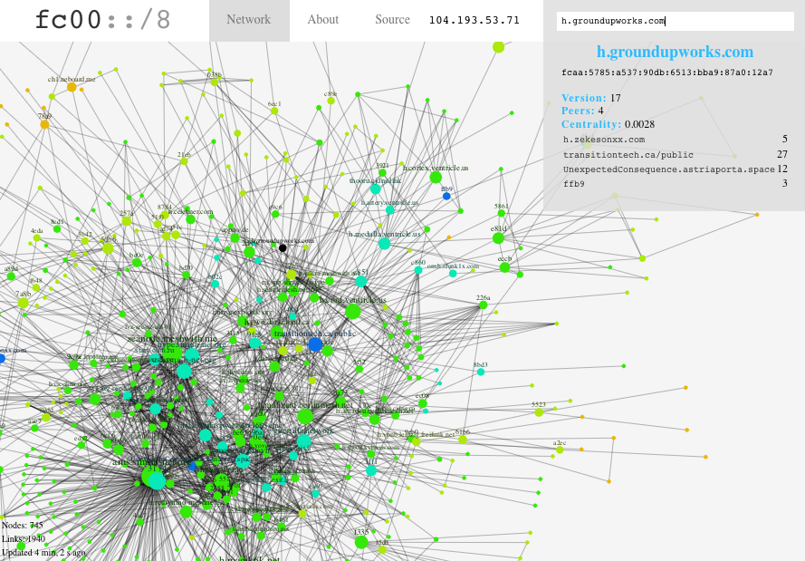

<!SLIDE bullets>
# Today's agenda #

* Why a community mesh?

* Hardware platform based on our Raspberry Pi router

* .callout Routing protocols and the cjdns software

* Get our hands dirty and hack something together :)

<!SLIDE>

<!SLIDE bullets>
# Routing protocols and management software #

* [B.A.T.M.A.N.](https://www.open-mesh.org/projects/batman-adv/wiki)

* [Gluon](http://gluon.readthedocs.io/en/)

* [Commotion](https://commotionwireless.net)

* .callout [cjdns](https://github.com/cjdelisle/cjdns)

<!SLIDE>
# Hyperboria #

Runs on OS X, Windows, all flavours of GNU/Linux, OpenWrt, Raspbian (Raspberry Pi), Android... so each node on [fc00.org](https://www.fc00.org) can be any of these and anywhere physically

<!SLIDE>
# Your Hyperboria identity #

	@@@ javascript
	~/D/p/g/cjdns ❯❯❯ ./cjdroute --genconf
	...
    // Private key:
    // Your confidentiality and data integrity depend on this key, keep it secret!
    "privateKey": "ee2e557f33ab509ddc49fb2fff91e2588d03b053be06af6297ec0079bc8fed68",

    // This key corresponds to the public key and ipv6 address:
    "publicKey": "fyjq991yjkqyvwbf6m8xf5zt7dsb7b21y83jy1nx1prd9nly3wu0.k",
    "ipv6": "fc83:c18c:e964:a7b7:86f:8c:9a86:6974",
    ...

* Address derived from cryptographic keys enables end-to-end encryption by default

* IPv6 global uniqueness allows disjoint meshnets to merge

* Valid **fc00::/8** addresses mean compatibility with all applications that support IPv6

<!SLIDE>
# Routing across the network #

* Each node makes up part of the infrastructure (i.e. route for your peers). Responsibilities:

	* Check who is around me (in address space)
	* Respond to other nodes
	* Pass *packets* along (encrypted packets arriving from peers)

* *Source routing* via [Kademlia DHT](https://en.wikipedia.org/wiki/Kademlia)

* Agnostic to physical interface

* [HYPERBORIA 101](http://n-o-d-e.net/post/139284891496/hyperboria-101-moving-through-the-mesh)

* [cjdns Whitepaper](https://github.com/cjdelisle/cjdns/blob/master/doc/Whitepaper.md)

<!SLIDE>
# Bring-up WiFi radio #

	@@@ bash
	# Shut down the wlan0 interface
	sudo ifconfig wlan0 down

	# Create mesh0 802.11s Mesh Point interface
	sudo iw dev wlan0 interface add mesh0 type mp

	# Bring up the mesh0 interface
	sudo ifconfig mesh0 up

	# Optionally assign IPv4 address to the mesh0 interface
	# sudo ifconfig mesh0 192.168.X.Y

	# Join the mesh network with radio in HT40+ htmode to enable 802.11n rates
	sudo iw dev mesh0 mesh join tomesh freq 2412 HT40+

	# Disable forwarding since we rely on cjdns to do routing and only uses Mesh Point as a point-to-point link
	sudo iw dev mesh0 set mesh_param mesh_fwding=0

*Source: https://github.com/tomeshnet/prototype-cjdns-pi2*

<!SLIDE>
# Start cjdns #

	@@@ bash
	# Get tools
	if ! [ "$(which git)" ] || ! [ "$(which nodejs)" ] || ! [ "$(which iperf3)" ]; then
        sudo apt-get update
        sudo apt-get install git nodejs iperf3
	fi

	# Get cjdns
	if ! [ -d "cjdns" ]; then
        git clone https://github.com/hyperboria/cjdns.git
	fi
	cd cjdns

	# Build cjdns with optimizations
	if ! [ -x "cjdroute" ]; then
        ./clean && NO_TEST=1 Seccomp_NO=1 CFLAGS="-s -static -Wall -mfpu=neon -mcpu=cortex-a7 -mtune=cortex-a7 -fomit-frame-pointer -marm" ./do
	fi

	# Generate cjdns node configurations
	if ! [ -f "cjdroute.conf" ]; then
        ./cjdroute --genconf > cjdroute.conf
	fi

	# Run cjdns
	sudo ./cjdroute < cjdroute.conf

*Source: https://github.com/tomeshnet/prototype-cjdns-pi2*