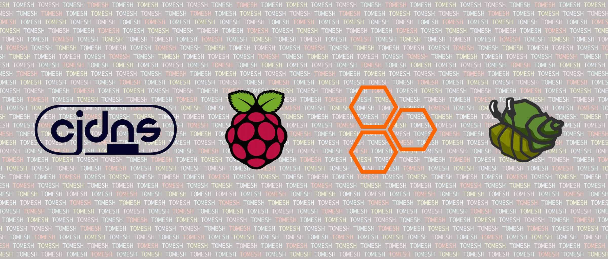

<!SLIDE title-slide>
# Build a Mesh Node #

*Meshing with cjdns and messing with secure-scuttlebutt*



**ansuz** *//* **garrying** *//* **benhylau**

14 Jan 2017

~~~SECTION:notes~~~

https://en.wikipedia.org/wiki/Cjdns#/media/File:Cjdns_logo.png
https://en.wikipedia.org/wiki/File:Raspberry_Pi_Logo.svg
https://github.com/tomeshnet/logos/blob/master/assets/hyperboria.svg
https://scuttlebot.io

~~~ENDSECTION~~~

<!SLIDE>
# What & Why #

**What** is a mesh network and **why** are we building it?

<br />


_What_

* Network topology where each node routes data for other nodes
* Does not rely on expensive central routers that take on the job of routing for everybody
* Form highly resilient "autonomous" networks

<!SLIDE>
# How to Mesh? #

If our goal is to get packets delivered, one simple solution is to **forward every packet to everyone!**


**Flooding** is indeed how some mesh protocols get packets delivered, which works for small networks. Although it's easy to see how this approach wouldn't scale, it does illustrate how each node has the responsibility of **forwarding** packets for its neighbours.

~~~SECTION:notes~~~

https://en.wikipedia.org/wiki/Flooding_(computer_networking)#/media/File:FloodAck.gif

~~~ENDSECTION~~~

<!SLIDE>
# Flooding vs. Routing #

* Simple flooding sounds **inefficient** and **insecure**...

	* *"Almost everything that I receive are not actually for me"*
	* *"I don't want everyone to get a copy of my mail"*
	* *"How do I know the message I receive is authentic?"*

* Routing involves pathfinding to a specific destination

* Packet is passed along a "good enough" path

* Today we are going to _securely_ _route_ _encrypted_ and _signed_ packets with **cjdns**

* More on cjdns later, now let's figure out why this mesh thing is a good idea at all

<!SLIDE>
# Why A Mesh Network #

We seem dissatisfied with the Internet:

* Complain about **ISP service**
* Complain about **agencies spying on us**
* Complain about **companies profiting from our personal information**
* Complain about **countries censoring the Internet**
* Complain about **browsers having shitty security implementations and the certificate model is all broken**


By sharing the work of routing, we create a **distributed infrastructure** where participation is more **democratic**, which in turn gives users **agency** over these issues we keep complaining about.

~~~SECTION:notes~~~

http://walyou.com/internet-explorer-voodoo-doll/

~~~ENDSECTION~~~

<!SLIDE>
# Why *Now* #

**Because we can!**

Mesh networking is no longer accessible only to well-funded military and commercial applications, nor does the knowledge reside within proprietary and academic circles.

* Lowering cost of radio devices and "open-hardware"

* Developments in meshnet technology and communities (e.g. [Battle Mesh](http://battlemesh.org/))

* Validation through established meshnets (e.g. [Freifunk](https://freifunk.net/en/), [Guifi.net](https://guifi.net/en))

* Distributed applications that are highly compatible with mesh topology

There are lots of **free and open-source** mesh software supported by communities running **production networks** with **affordable hardware**, and tons of **distributed applications** running on them.

Today we will not only build a mesh network, but also play with some distributed applications that are [more compatible with social equity and democratic societies](https://transitiontech.ca/pdf/Winner-Do-Artifacts-Have-Politics-1980.pdf), like a [peer-to-peer social network](https://github.com/ssbc/patchwork) and an [alternate domain name system (DNS)](https://github.com/ansuz/dnssb/blob/master/docs/WHY.md).

<!SLIDE>
# Meshing with cjdns #

A _near-zero configuration_ mesh protocol

**Generate a config file:**

	$ ./cjdroute --genconf > cjdroute.conf

This creates your unique cryptographic keys and node identity:

    privateKey: cb9c35a8beda7151341eed31ac4ece78288729ee51c37d71c475e514286c7bb0
    publicKey:  8q02ty48xf8qr9w70nbuw44n8bdthzf3hyl393bzku7nkb5bn250.k
    ipv6:       fc0b:6794:7937:9c15:5f38:a4cf:a7a9:5109

**Run with the config file:**

	$ sudo ./cjdroute < cjdroute.conf

All this is taken care of for you by the [tomesh install script](https://github.com/tomeshnet/prototype-cjdns-pi2/blob/master/scripts/install)! You run the installation once, it will generate the identity automatically, and each time you power up the Raspberry Pi it will start **cjdroute** with the generated **cjdroute.conf**.

<!SLIDE>
# Setting Up Your Node #

Grab a Pi 3 + [TL-WN722N](http://www.tp-link.com/en/products/details/TL-WN722N.html), then run [our installation script](https://github.com/tomeshnet/prototype-cjdns-pi2/blob/master/README.md#set-up), instructions reproduced here:

1. Flash the SD card with [Raspbian Jessie Lite](https://www.raspberrypi.org/downloads/raspbian/).

1. Create an empty file named **ssh** to enable SSH when the Pi boots.

1. Plug the SD card and TL-WN722N into the Pi.

1. Plug the Pi into your router, so it has connectivity to the Internet. SSH into the Pi with `ssh pi@raspberrypi.local` and password **raspberry**.

    **Optional:** There are other ways to connect, such as connecting the Pi to your computer and sharing Internet to it. Or if you have multiple Pi's connected to your router, find its IP with `nmap -sn 192.168.X.0/24` (where 192.168.X is your subnet) and SSH to the local IP assigned to the Pi you want to address `ssh pi@192.168.X.Y`.

1. In your SSH session, run `passwd` and change your login password. It is very important to choose a strong password so others cannot remotely access your Pi.

1. Run the following, then let the installation complete. After about 5 minutes the Pi will reboot:

    ```
    $ wget https://raw.githubusercontent.com/tomeshnet/prototype-cjdns-pi2/master/scripts/install && chmod +x install && WITH_MESH_POINT=true WITH_WIFI_AP=true WITH_IPFS=false ./install
    ```

<!SLIDE>
# Connecting to Each Other #

**Check status:**

	$ source ~/prototype-cjdns-pi2/scripts/status

**Ping another node:**

	$ ping6 ANOTHER_CJDNS_IPV6_ON_THE_NETWORK

**SSH to another node:**

	$ ssh pi@CJDNS_IPV6

With your cjdns IPv6 address as unique identity, you can host all kinds of web applications on your Raspberry Pi!

<!SLIDE>
# Your View of The Network #

**Immediate Peers:**

	$ nodejs /opt/cjdns/tools/peerStats

	v17.0000.0000.0000.0017.fwtwcm4uh1606zlpkj29sb8rm3ms74fjjfumhy7d0xhbmptndmt0.k ESTABLISHED in 9kb/s out 4kb/s  LOS 7 "outer"
	v17.0000.0000.0000.0015.6fpkf4xux4chbnu1kyu9j8xntz0h8c3l1s0k1njnxq3sxx2rgm80.k ESTABLISHED in 14kb/s out 6kb/s  LOS 6 "outer"
	v17.0000.0000.0000.0013.2scyvybg4qqms1c5c9nyt50b1cdscxnr6ycpwsxf6pccbmwuynk0.k ESTABLISHED in 12kb/s out 26kb/s  LOS 15 "groundupworks.com"

**Routing Table:**

	$ nodejs /opt/cjdns/tools/dumptable

	ver       path                               addr                            bucket metric lastPinged
	v17.0000.0000.0000.0001.fn8zzfm784thq3phpf200r1d7k7ry7qdfpub9qc4nw75csnzhbz0.k 127 0 3568306
	v17.0000.0000.0000.0013.2scyvybg4qqms1c5c9nyt50b1cdscxnr6ycpwsxf6pccbmwuynk0.k 0 1024 13603
	...
	v16.0061.2e49.216a.b357.kcf3m6d2yjdr9jl9z89yt8nwrhq1zs051d452xnfnmkv3m9zuzq0.k 6 1049600 22122
	v17.0362.e269.4688.2633.4wnxxh40hv3njsnsq2d5kl2ccfqx1l6rfykqkhc34nnnh41zkqx0.k 2 3055746 438536
	v16.0533.ed49.216a.b357.m5dgp67mz1c7bjlcfdckx9vuph3dcdy9qj5mhmkf4mutuy2wb5k0.k 6 1050624 18883
	v17.098c.8628.ff13.e2b3.nbdngu4xn5x5wh111dndv6nx1x4f7hbz1q05pld4tf6rgfdvksh0.k 0 2100224 15838
	131 nodes 3 peers

<!SLIDE>
# Automatically Discovering ETHInterface Peers #

* [802.11s Mesh Point](https://en.wikipedia.org/wiki/IEEE_802.11s) is a IEEE extension for mesh networking

* Relies on one of 802.11a/b/g/n/ac

* Supported in some radios, such as the TP-LINK TL-WN722N we have

* Mesh over Layer 2 (Ethernet frames), so we still need some sort of Layer 3 infrastructure (IP addresses)

* We currently use it to form point-to-point links with forwarding disabled, relying on cjdns to do mesh routing, and the cjdns IPv6 for IP addressing

* cjdns automatically binds to this **ETHInterface** and route encrypted packets over it

* The local mesh that we just formed is established through these Mesh Point interfaces, communicating over our USB WiFi radios

* This feature was enabled when we ran the installation script with `WITH_MESH_POINT=true`

<!SLIDE>
# Manually Adding UDPInterface Peers #

1. Edit the config file: `sudo nano /etc/cjdroute.conf`

2. Find the **UDPInterface** section:

		"UDPInterface":
	    [
	        {
	            // Nodes to connect to (IPv4 only).
	            "connectTo":
	            {
	                // Ask somebody who is already connected.
	            }
	        },
	        ...
	    ]

3. Paste credentials of one or more [North American public peers from **peers.fc00.io**](https://peers.fc00.io/1/location/na) into the `"connectTo"` section

4. Restart cjdroute: `sudo killall cjdroute`

More details: https://github.com/cjdelisle/cjdns/blob/master/doc/cjdns/peering-over-UDP-IP.md

<!SLIDE>
# Securing Your Node #

* Devices on your home network are generally not addressable from the public Internet due to network address translation (NAT) by your router

* Your cjdns IPv6 is globally unique and publicly addressable by other nodes on the mesh network

* Scan for open services accessible on your cjdns IP address [using **nmap** port scan and **netstat**](https://github.com/cjdelisle/cjdns/blob/master/doc/network-services.md):

		$ nmap -6 -n -r -v -p1-65535 -sT YOUR_CJDNS_IPV6

<!SLIDE>
# cjdns Configurations #

What else is in this **/etc/cjdroute.conf** file?

* **admin**: The Admin API you can send messages to, which controls the running cjdroute process

* **interfaces**: The supported peering interfaces

	* **ETHInterface**: Peering over Ethernet broadcast domain (automatic over Layer 2)

	* **UDPInterface**: Peering over IP (manual over Layer 3/4, automatic over multicast has been discussed)

* **authorizedPasswords**: Credentials for manual peering over the UDPInterface

* **router**: Controls the cjdns router layer

	* **ipTunnel**: Use switch layer as VPN carrier to exit mesh traffic to the Internet

_cjdns IP Tunnel_

* We can use this to [let anyone run an ISP](https://github.com/tomeshnet/mesh-isp)

* Or build a VPN Access Point at home...

<!SLIDE>
# Building a VPN Access Point #

1. Ensure you have run the [Pi 3 installation script](https://github.com/tomeshnet/prototype-cjdns-pi2) with the flag `WITH_WIFI_AP=true`, which sets up a **tomesh-****** Access Point for your devices to connect to

1. Add the VPN server public key `cmnkylz1dx8mx3bdxku80yw20gqmg0s9nsrusdv0psnxnfhqfmu0.k` to `"router":"ipTunnel":"outgoingConnections"`, this allows cjdns to locate the VPN server

1. Optionally add the VPN server as a peer so that you will get the optimum connection to it:

		"198.167.222.70:54673": {
		  "login": "ipredator.se/cjdns_public_node",
		  "password": "use_more_bandwidth",
		  "publicKey": "cmnkylz1dx8mx3bdxku80yw20gqmg0s9nsrusdv0psnxnfhqfmu0.k"
		}

1. In **/etc/systemd/system/hostapd.service** find the line `ExecStartPost=...` and replace `eth0` with `tun0`, this tells the Pi to route all non-Hyperboria traffic through the cjdns virtual interface, which eventually exits at the VPN provider

1. Add your cjdns public key here and wait for the VPN provider to add as an allowed client: https://cryptpad.fr/code/#/1/edit/8vSLjCdegVktO1YaBPTbJw/Apy39zwJRWFoIv1yHwTLEoD4

1. Once approved, use some of these APIs to find out your exit location:

		$ curl ifconfig.co
		$ curl ifconfig.co/country
		$ curl ifconfig.co/city
