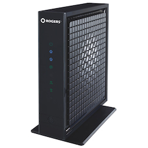
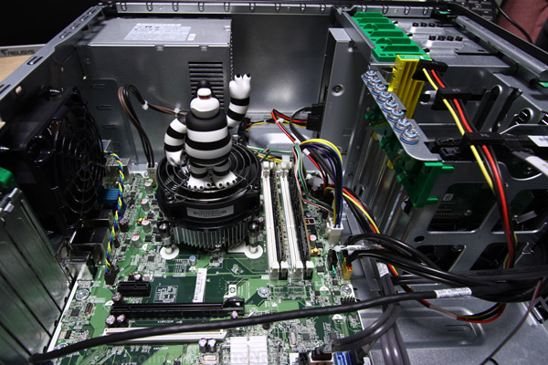
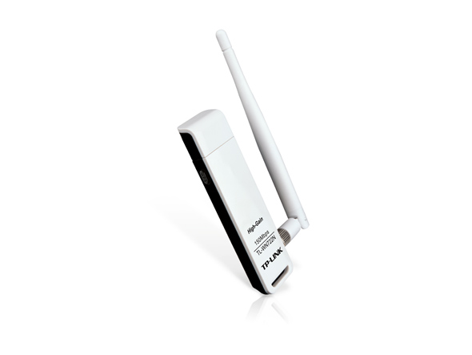
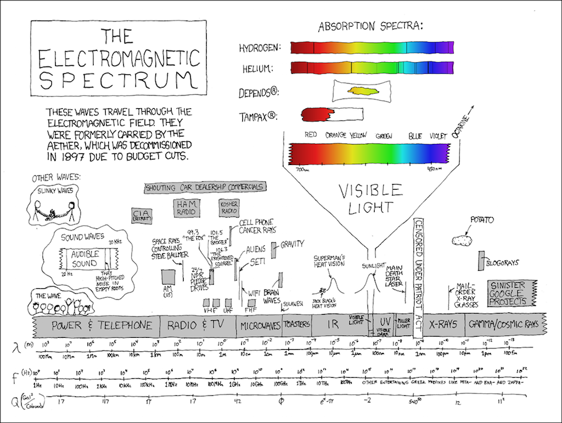
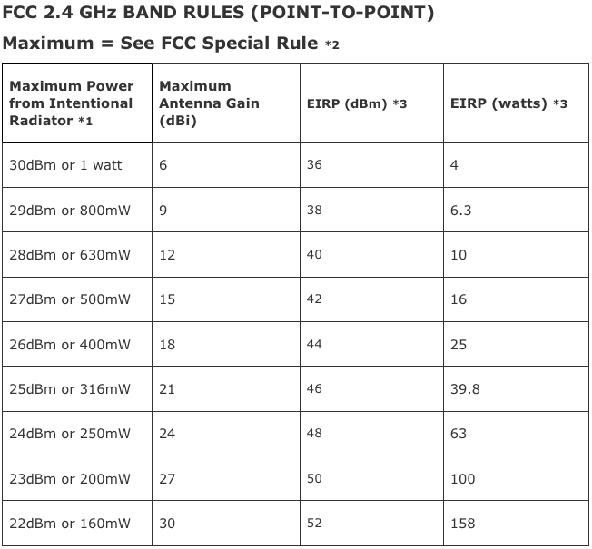
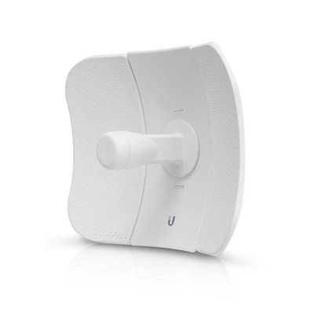

<!SLIDE bullets>
# Today's agenda #

* Why a community mesh?

* .callout Hardware platform based on our Raspberry Pi router

* Routing protocols and the cjdns software

* Get our hands dirty and hack something together :)

<!SLIDE>

<!SLIDE>
# We need a router #

Replace...

With...

* Router (Raspberry Pi)
* Radio
* Antenna

<!SLIDE>
# What is a Raspberry Pi? #

Open up a computer...

*Photo credit: http://cazphoto.co.uk/toybox2012/day-104/*

<!SLIDE>
# What is a Raspberry Pi? #

Low-cost single-board computer

<!SLIDE>
# Radio & antenna #

TP-Link TL-WN722N

<!SLIDE>
# What does that thing do? #

*Photo credit: http://wirelesslanprofessionals.com/wp-content/uploads/2010/02/electromagnetic_spectrum.png*

~~~SECTION:notes~~~

Spectral properties:

* Regulation

* Range due to absorption in different medium

~~~ENDSECTION~~~

<!SLIDE>
# FCC regulations on 2.4 GHz WiFi band #

*Source: http://www.air802.com/fcc-rules-and-regulations.html*

~~~SECTION:notes~~~

Spectral properties:

* Radio power in dBm

* Antenna gain (and therefore directionality) in dBi

* For a particular gain, your radio power has an allowed upper bound

~~~ENDSECTION~~~

<!SLIDE>
# Directional WiFi #

Ubiquiti LiteBeam AC

* Radio power: 25 dBm
* Antenna gain: 23 dBi
* Range: 10s of kilometres
* Data speeds: gigabit (that's about 100 MB per second)
* Power consumption: 7 W
* Cost: CAD 80

~~~SECTION:notes~~~

* Proprietary protocol and AirOS router software

~~~ENDSECTION~~~
