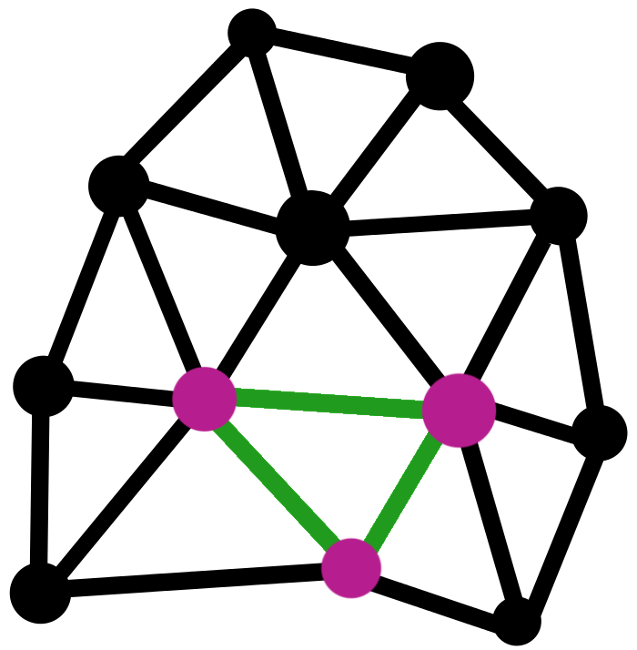
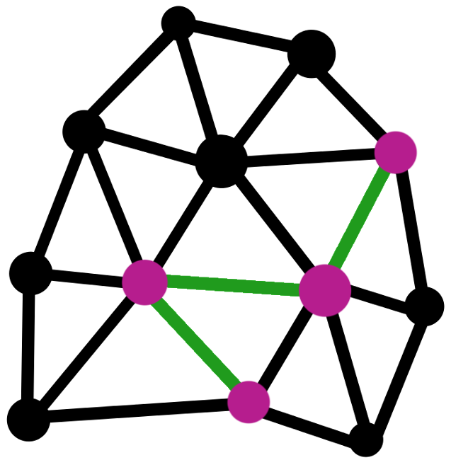
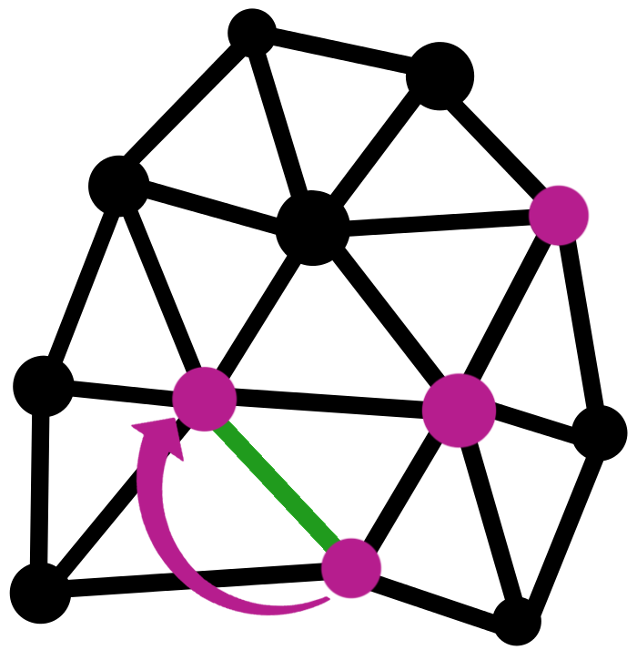
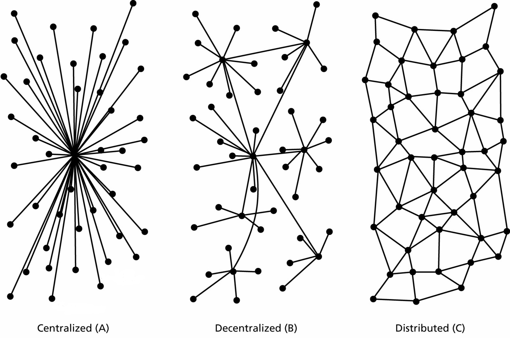

!SLIDE

# Networks

!SLIDE

# Parts of a Network

!SLIDE

# Parts of a Network

!SLIDE

# Moving Through a Network

!SLIDE

# Moving Through a Network

!SLIDE

# Moving Through a Network

!SLIDE

# Moving Through a Network

!SLIDE

# Moving Through a Network

!SLIDE

# Network Types

~~~SECTION:notes~~~
Presentation should cover the following terms:

Parts of a network
  Link
  Node
Moving around a network
  Hop
  Route/Path
  Data/Packet
Common topologies (physical vs. conceptual), for conceptual bucketed as:
  centralized;
  decentralized;
  distributed

~~~ENDSECTION~~~

~~~SECTION:notes~~~
Image credit (1964) Paul Baran, On distributed communications networks

~~~ENDSECTION~~~

~~~SECTION:notes~~~
## Workshop Schedule

1:00 - Workshop Start
1:10 - 1:40 (0:30) I: What we know about computers and the internet
1:40 - 2:30 (0:50) II: How computers talk
2:30 - 2:40 BREAK
2:50 - 4:00 (0:50) III: Networks include people!

## Section II: What we know about computers and the internet

Goals:
- Identify basic (technical/structural) components of a network
- Make a case for why networks are fundamental and popular

Activity:

1. Needs / Yields Yarn Toss (10 mins)
2. Quick Terminology Presentation (10 mins)
3. Embodying a Network Activity (30 mins)

~~~ENDSECTION~~~
